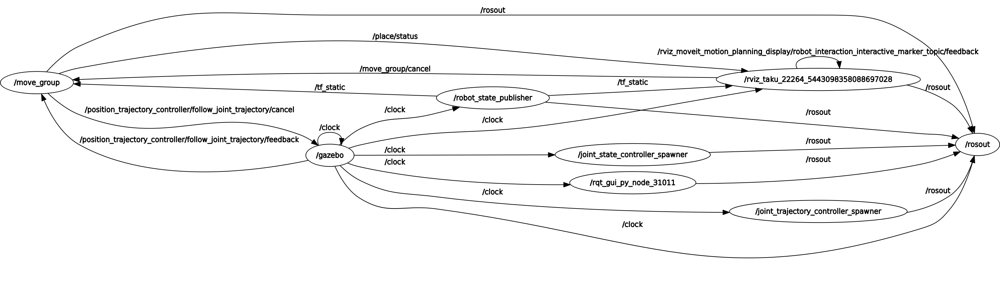

# kuka_kr150
Startup Gazebo and spawn kuka kr150 3d model:  
`roslaunch kuka_kr150_gazebo test_kr150_gazebo.launch`

Startup rviz to plan and execute:  
`roslaunch kuka_150_moveit_config moveit_planning_execution.launch`

